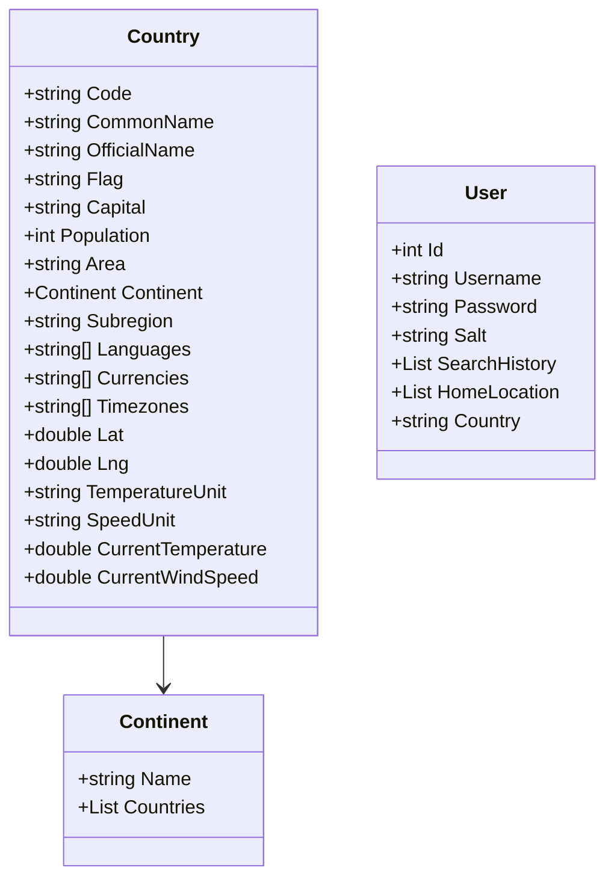

# Spis treści
1. [Nazwa oraz opis projektu](#nazwa-oraz-opis-projektu)
2. [Instalacja](#instalacja)
3. [Licencja](#licencja)
4. [Kontakt](#kontakt)
5. [Kolaboracja](#kolaboracja)
6. [Podsumowanie](#podsumowanie)

# Nazwa oraz opis projektu
EuroExplorer to zaawansowana aplikacja mobilna stworzona z myślą o odkrywaniu i poznawaniu różnorodnych informacji na temat krajów Unii Europejskiej. Główne funkcje i cechy aplikacji obejmują:

1. Informacje o krajach: EuroExplorer oferuje szczegółowe opisy każdego z państw członkowskich UE, obejmujące takie dane jak stolica, powierzchnia, liczba ludności, języki urzędowe, waluta i inne istotne informacje.

2. Historia i kultura: Aplikacja umożliwia zgłębianie historii i kultury poszczególnych krajów. Użytkownicy mogą dowiedzieć się więcej o zabytkach, tradycjach, świętach narodowych i innych aspektach kulturowych.

3. Geografia i przyroda: EuroExplorer zawiera dane geograficzne, takie jak ukształtowanie terenu, najwyższe szczyty, główne rzeki i inne ciekawostki geograficzne. Dodatkowo, informacje o parkach narodowych i rezerwatach przyrody są również dostępne.

4. Interaktywne mapy i wizualizacje: Aplikacja oferuje interaktywne mapy, które pomagają użytkownikom lepiej zrozumieć geograficzne i demograficzne różnice między krajami UE.

5. Porównywanie krajów: Funkcja porównywania umożliwia użytkownikom łatwe porównanie różnych danych między różnymi krajami, co pozwala na lepsze zrozumienie ich podobieństw i różnic.

6. Edukacyjne narzędzie: EuroExplorer może być również wykorzystywany jako narzędzie edukacyjne, zarówno dla studentów, jak i dla osób chcących poszerzyć swoją wiedzę na temat Unii Europejskiej i jej członków.

Dzięki EuroExplorer użytkownicy mogą poznać bogactwo różnorodności kulturowej, geograficznej i historycznej Unii Europejskiej, co czyni tę aplikację nieocenionym źródłem informacji dla podróżników, studentów, dziennikarzy oraz wszystkich zainteresowanych tym dynamicznym regionem świata.
  
  # Instalacja
    Problem z otwrciem projektu ?
    
1. Stwórz nowy projekt "Aplikacja Windows Forms", nazwa oraz reszta nie jest istotna.
2. Platforma jest napisana w ".NET 8.0".
3. Kliknij utwórz.
4. Gdy mamy otwarty program to klonujemy repozytorium z linku "https://github.com/alanpudelko/projektObiektowe"
5. W prawym dolnym rogu klikając w "main" wybieramy elementy zdalne oraz "origin/master"
6. 

7. Otwierając Eksplorator rozwiązań szukamy pliku "EuroExplorer.csproj" klikamy w to prawym "Otwórz folder w Eksploratorze plików"
8. 

9. W otwartym folderze szukamy "EuroExplorer.csproj" klikamy 2x Lewym otworzy nam się na nowo projekt.
10. Ciesz się funkcjonalnością programu po kompilacji.

# Diagram UML

# Licencja
[AGPL-3.0 license](https://github.com/alanpudelko/projektObiektowe/tree/master?tab=AGPL-3.0-1-ov-file)

## Kontakt

Autor: Rafał Sak

Email: rafalsak@op.pl

GitHub: https://github.com/RafalSa

## Kolaboracja

Alan Pudełko

Igor Radziszewski

## Podsumowanie
## Koncept
EuroExplorer to fascynujący projekt mający na celu promowanie podróży po różnych krajach Europy oraz odkrywanie ich kultury, historii i dziedzictwa. Projekt skupia się na zapewnieniu użytkownikom pełnego wglądu w bogactwo różnorodności europejskiej poprzez interaktywne narzędzia, które ułatwiają planowanie podróży i poznawanie nowych miejsc.

Aplikacja miała założenia takie jak:
1. Interaktywna Mapa Geograficzna: EuroExplorer oferuje interaktywną mapę, która umożliwia użytkownikom eksplorację geografii i atrakcji poszczególnych krajów Unii Europejskiej. Użytkownicy mogą przybliżać i oddalać mapę, klikając na poszczególne kraje, aby uzyskać szczegółowe informacje.

2. Baza Wiedzy o Krajach: Projekt zawiera bogatą bazę wiedzy na temat każdego kraju UE, obejmującą historię, kulturę, tradycje, kuchnię i inne istotne informacje. Użytkownicy mogą zgłębiać szczegóły dotyczące miejsc do odwiedzenia, lokalnych festiwali oraz ważnych wydarzeń historycznych.

3. Edukacja i Świadomość: EuroExplorer dąży do edukowania użytkowników o różnorodności kulturowej Europy poprzez przedstawianie unikalnych cech każdego kraju. Projekt promuje zrozumienie i szacunek dla różnych kultur oraz zachęca do poszerzania horyzontów poprzez podróże i poznawanie nowych miejsc.

4. Integracja Społecznościowa: Platforma umożliwia użytkownikom dzielenie się swoimi doświadczeniami i opiniami na temat podróży po Europie. Możliwość komentowania, oceniania i polecania miejsc pozwala na budowanie społeczności pasjonatów podróży.

Prawdziwa realizacja zamknęła się do:
1. Interaktywna Mapa Geograficzna
2. Baza Wiedzy o Krajach
3. Edukacja i Świadomość
Pomimo osiągnięcia trzech czwartych założeń projektu EuroExplorer, pozostające 1/4 może zostać zrealizowane w przyszłości, gdy tylko znajdzie się więcej czasu oraz zostaną naprawione błędy. Pracujemy nad tym, aby dostarczyć pełną funkcjonalność platformy, zapewniając interaktywną mapę, szeroką bazę wiedzy o krajach UE, integrację społecznościową oraz praktyczne wsparcie dla podróżników. Naszym celem jest stworzenie inspirującego narzędzia, które nie tylko ułatwia podróżowanie po Europie, ale także promuje zrozumienie i szacunek dla różnorodności kulturowej kontynentu.

Całość projektu była dokładnie planowana podczas pierwszych spotkań oraz ewentualnie korygowana i kwestionowana wraz z rozwojem projektu.

# Założenia przedmiotu
Projekt był stworzony na potrzebę przedmiotu "Programowanie obiektowe". Podstawowe wymagania zawierały, aby były zastosowane następujące pojęcia: interfejsy, dziedziczenie, polimorfizm oraz hermetyzacja przy użyciu paradygmatu programowania obiektowego. Poniżej przedstawię gdzie i jak zostały użyte w naszym projekcie:

Klasa Country jest dobrym przykładem hermetyzacji. Wszystkie pola są prywatne (domyślnie) i dostęp do nich jest zapewniony za pomocą publicznych właściwości (get i set), co jest kluczowym aspektem hermetyzacji.
Hermetyzacja jest widoczna w klasie CountryInfo. Wszystkie pola są prywatne (private) i dostęp do nich jest ograniczony. Na przykład, _continentTextBox jest prywatnym polem, które jest dostępne tylko wewnątrz klasy CountryInfo.  

Dziedziczenie teoretycznie znajduje się prawie wszedzie ponieważ dziedziczenie wygląda następująco Belgia : Form jest to przykład z projektu jestli jest pomiędzy nimi ":" to oznacza ze dochodzi do dziedziczenia Belgia dziedziczy po Form.

W przedstawionym kodzie polimorfizm występuje głównie w kontekście metod wirtualnych i przesłanianych (override). Oto, gdzie możemy go znaleźć i jak działa:
Polimorfizm w kodzie
protected override async void OnLoad(EventArgs e)
{
    base.OnLoad(e);
    await GetCurrentTimeInViennaAsync();
}
Opis polimorfizmu
Metoda OnLoad:
Ta metoda jest przesłanianiem (override) metody OnLoad z klasy bazowej Form. Kiedy aplikacja Windows Forms ładuje formularz Austria, wywoływana jest metoda OnLoad. Dzięki polimorfizmowi metoda OnLoad z klasy Austria jest wywoływana zamiast metody OnLoad z klasy bazowej Form. To umożliwia wykonanie dodatkowych operacji specyficznych dla formularza Austria, takich jak pobranie aktualnego czasu w Wiedniu.
Wywołanie base.OnLoad(e) zapewnia, że wykonana zostanie również standardowa logika ładowania formularza zdefiniowana w klasie bazowej.

Interfejs IUserSearchHistory definiuje operacje związane z historią wyszukiwań użytkownika. Zawiera następujące elementy:

SearchHistory: Lista ciągów znaków przechowująca historię wyszukiwań użytkownika.
AddToSearchHistory(string searchTerm): Metoda dodająca nowy element do historii wyszukiwań.
ClearSearchHistory(): Metoda czyszcząca historię wyszukiwań.
kod
public interface IUserSearchHistory
{
    List<string> SearchHistory { get; set; }
    void AddToSearchHistory(string searchTerm);
    void ClearSearchHistory();
}
